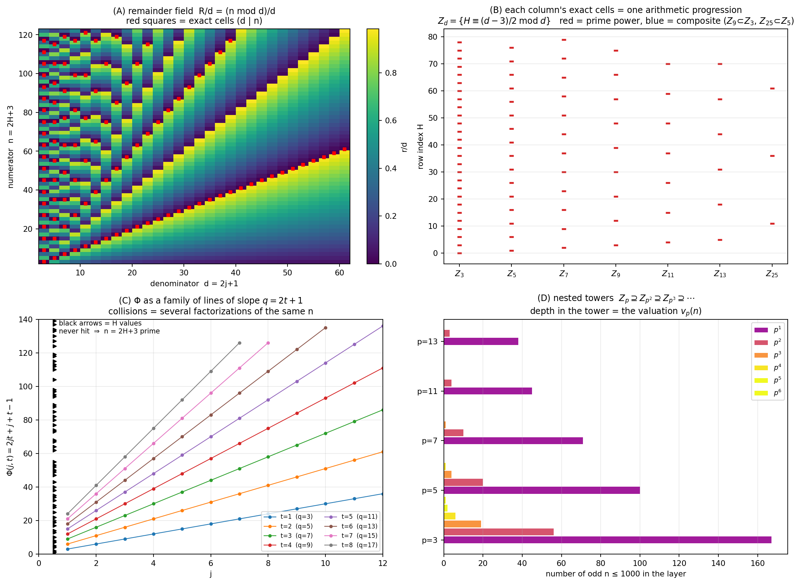

# From the Odd Division Table to Prime-Power Towers

### A geometric and algebraic reorganization of factorization, stopping before the zeta function

July 2026

---

## Abstract

We start from the elementary table of divisions `n / d` with `n` and `d` odd, and show that a change of coordinates turns it into a completely transparent object. Writing `n = 2H + 3` and `d = 2j + 1`, the remainder field becomes `R(H,j) = 2(H − j + 1) mod (2j+1)`, and the exact cells of each column form a single arithmetic progression. Non-trivial exact divisions are then parametrized by the bivariate map `Φ(j,t) = 2jt + j + t − 1`, whose image is exactly the set of row indices of odd composites — a statement that turns out to be the sieve of Sundaram in a shift of coordinates. We prove the factor symmetry `Φ(j,t) = Φ(t,j)`, identify the triangular fundamental domain `j ≤ t` as trial division up to `√n`, and show that the number of ordered preimages of `H` is `τ(n) − 2`, so that the divisor function appears as the collision count of a family of straight lines.

The table is then decomposed into divisibility layers. Every composite layer is an intersection of prime-power layers, so the prime-power columns form a generating system and every other column is redundant. Depth in the resulting nested towers is the `p`-adic valuation, and the valuation vector `V(n)` reconstructs `n` together with `τ`, `φ`, `μ` and `Λ`. We quantify the resulting compression and show that it is exactly of prime-number-theorem size, growing like `(log N)/2`. Every claim is verified numerically with no failures. The exposition stops deliberately before any use of the Riemann zeta function.

**Keywords:** division table, remainders, primes, factorization, sieve of Sundaram, divisor function, `p`-adic valuations, Möbius function, von Mangoldt function.

---

## 1. Introduction and scope

Division is usually treated as an isolated operation: you are handed `n` and `d`, and you produce a quotient and a remainder. This paper takes the opposite view. We lay out *all* the divisions at once, in a table, and ask what shape that table has.

The answer is that the table has a very rigid shape, and that almost all of it is redundant. The exact cells — the places where the division comes out whole — sit on arithmetic progressions; those progressions are generated by the prime-power columns alone; and every classical multiplicative function is a reading of how deep a row sits in those progressions.

**Scope.** This paper ends at the reconstruction of arithmetic functions from prime-power towers. It contains no zeta function, no zeros, no explicit formula, and no positivity criterion. It also claims no new arithmetic: everything proved here is elementary, and §5 in particular is a known sieve, attributed in §5.1. What is offered is a complete and self-contained reorganization, together with an explicit account of its limits (§13).

---

## 2. What the division table actually is

This section assumes nothing. A reader who already knows the construction can skip to §3.

### 2.1 The object

Take the odd integers `3, 5, 7, 9, 11, …` and use them twice: once as **row labels** (the numerator `n`) and once as **column labels** (the denominator `d`). In the cell at row `n` and column `d`, write the result of the division:

```
n / d  =  q  +  r/d ,        0 ≤ r < d ,
```

where `q` is the quotient and `r` the remainder. Here is a sample of the table (the rows are a selection, not consecutive — the pattern is easier to see this way):

| n \ d | H | ÷3 | ÷5 | ÷7 | ÷9 | ÷11 |
|---|---|---|---|---|---|---|
| **9** | 3 | **3** | 1 4/5 | 1 2/7 | **1** | 0 9/11 |
| **11** | 4 | 3 2/3 | 2 1/5 | 1 4/7 | 1 2/9 | **1** |
| **13** | 5 | 4 1/3 | 2 3/5 | 1 6/7 | 1 4/9 | 1 2/11 |
| **15** | 6 | **5** | **3** | 2 1/7 | 1 6/9 | 1 4/11 |
| **17** | 7 | 5 2/3 | 3 2/5 | 2 3/7 | 1 8/9 | 1 6/11 |
| **21** | 9 | **7** | 4 1/5 | **3** | 2 3/9 | 1 10/11 |
| **25** | 11 | 8 1/3 | **5** | 3 4/7 | 2 7/9 | 2 3/11 |
| **27** | 12 | **9** | 5 2/5 | 3 6/7 | **3** | 2 5/11 |
| **35** | 16 | 11 2/3 | **7** | **5** | 3 8/9 | 3 2/11 |
| **45** | 21 | **15** | **9** | 6 3/7 | **5** | 4 1/11 |

Cells in **bold** are the ones where the remainder is zero — the *exact cells*.

### 2.2 Why only odd numbers

Including the even numbers adds nothing and costs clarity. Every even number is `2` times something, so the entire column `d = 2` and every even row are a single trivial statement repeated. Restricting to odd `n` and odd `d` removes that repetition and — crucially for §3 — makes `2` invertible modulo every denominator, which is what makes the coordinate change work.

### 2.3 What to look at

Three observations, in increasing order of usefulness.

**(i) A prime row is an empty row.** Look at rows `11, 13, 17`. Apart from the cell `d = n` itself, they contain no bold entry at all. That is the definition of primality read off the table: *`n` is prime exactly when its row has no non-trivial exact cell.*

**(ii) A column is periodic.** Look down the column `÷3`: the exact cells are at `n = 9, 15, 21, 27, 45, …` — every third odd number. Column `÷5` is exact at `n = 15, 25, 35, 45, …` — every fifth odd number. Every column is a perfectly regular comb; the columns differ only in their period and in where the comb starts.

**(iii) The table is mostly redundant.** Column `÷9` is exact only at rows where column `÷3` is already exact (`9, 27, 45, …`) — it is a *sub-comb* of `÷3`. Similarly `÷25 ⊂ ÷5`. And a column like `÷15` is exact exactly where `÷3` **and** `÷5` are both exact. So a composite column tells you nothing you could not read off the prime-power columns.

Those three observations are, respectively, §5, §4, and §9 of what follows. Everything else is bookkeeping designed to make them exact.

### 2.4 The change of coordinates, and why it helps

The table as written is awkward because the row and column labels are the odd numbers `3, 5, 7, …`, and "every third odd number" is a clumsy thing to say. So we re-label by *position*:

```
row    n = 2H + 3     ⇒   H = (n − 3)/2  = 0, 1, 2, 3, …
column d = 2j + 1     ⇒   j = (d − 1)/2  = 1, 2, 3, …
```

`H` is the row's position counted from the top (`n = 3` is `H = 0`), and `j` is the column's position counted from the left (`d = 3` is `j = 1`).

In these coordinates the three observations become clean statements: a column is an arithmetic progression in `H` (§4), the composite rows are the image of a single bilinear map (§5), and the layers nest (§9). That is the whole content of the coordinate change — it converts "every third odd number starting at 9" into "`H ≡ 0 mod 3`".

**Figure 1** shows the four resulting pictures: the remainder field with the exact cells marked, the columns as arithmetic progressions, the map `Φ` as a family of straight lines, and the nested towers.



---

## 3. Coordinates and the remainder field

Fix the notation of §2.4, and define the **cell index counted from the right**,

```
k = H − j + 1 .
```

**Proposition 1 (unified remainder formula).** For all `H ≥ 0` and `j ≥ 1`,

```
R(H, j)  :=  n mod d  =  2(H − j + 1)  mod  (2j + 1)  =  2k mod d ,
```

where `mod` denotes the least non-negative residue.

*Proof.* `n − d = (2H + 3) − (2j + 1) = 2(H − j + 1) = 2k`, so `n = d + 2k` and `n ≡ 2k (mod d)`. ∎

The residue convention is not cosmetic: when `j > H + 1` the denominator exceeds the numerator and `k` is negative, and the formula continues to hold only with that reading. For instance `n = 9`, `d = 11` gives `k = −1` and `2k mod 11 = 9 = 9 mod 11`.

*Verified:* 419,400 cells (`H < 600`, `j < 700`), including the whole `k < 0` region — zero mismatches.

---

## 4. Exact cells, and why every column is a comb

**Proposition 2 (equivalent forms of exactness).** The following are equivalent:

1. `d | n`;
2. `R(H,j) = 0`;
3. `d | k`;
4. `H ≡ j − 1 (mod d)`;
5. `H ≡ (d − 3)/2 (mod d)`.

*Proof.* (1) ⟺ (2) is the definition. By Proposition 1, `R = 0` ⟺ `d | 2k`; since `d` is odd, `gcd(2,d) = 1`, so this is `d | k`, giving (3). Substituting `k = H − j + 1` gives `H ≡ j − 1 (mod d)`, which is (4); and `j − 1 = (d−1)/2 − 1 = (d−3)/2` gives (5). ∎

*Verified:* all five conditions agree on every cell with `H < 3000`, `j < 80` — zero mismatches.

**Corollary (columns are arithmetic progressions).** In column `j`, the exact cells are exactly

```
H = (j − 1) + t·(2j + 1) ,      t = 0, 1, 2, …
```

equivalently `n = d·(2t + 1)`. The case `t = 0` is the trivial cell `n = d`; non-trivial exact division means `t ≥ 1`.

This is observation 2.3(ii) made exact: **each column is a single arithmetic progression of period `d`, starting at `H = (d−3)/2`.** The quotient is always odd, and equals `2t + 1`.

---

## 5. The factor map `Φ`

Non-trivial exactness means `n = d·q` with both factors odd and greater than one. Write `d = 2j+1` and `q = 2t+1` with `j, t ≥ 1`. Then

```
2H + 3 = (2j + 1)(2t + 1) = 4jt + 2j + 2t + 1
⇒  H = 2jt + j + t − 1 .
```

**Definition.** `Φ(j,t) = 2jt + j + t − 1`, for `j, t ≥ 1`.

**Theorem 1 (characterization of odd composites).** For odd `n = 2H + 3 ≥ 9`:

```
n is composite   ⇔   H ∈ Im(Φ) ,
n is prime       ⇔   H ∉ Im(Φ) .
```

*Proof.* If `H = Φ(j,t)` then `n = (2j+1)(2t+1)` with both factors `≥ 3`, so `n` is composite. Conversely, if `n` is an odd composite, write `n = d·q` with `d, q ≥ 3`; both are odd, so `d = 2j+1`, `q = 2t+1` with `j, t ≥ 1`, and the computation above gives `H = Φ(j,t)`. ∎

*Verified:* odd `n ≤ 200001`, zero mismatches.

### 5.1 Relation to the sieve of Sundaram

Theorem 1 is not new, and it is worth naming the classical statement it coincides with. Setting `m = H + 1`,

```
Φ(j,t) + 1  =  j + t + 2jt ,        n = 2H + 3 = 2m + 1 ,
```

so Theorem 1 reads: *`2m + 1` is composite if and only if `m = j + t + 2jt` for some `j, t ≥ 1`*. This is the **sieve of Sundaram**, published in 1934. The identity `Φ(j,t) + 1 = j + t + 2jt` is verified identically.

Consequently Theorem 1, the symmetry of §6 and the line geometry of §8 are classical. The parts of this paper that genuinely use the *table* rather than only its zero set are §7 (multiplicity as the divisor function) and §§9–11 (the tower decomposition).

---

## 6. Symmetry and the fundamental domain

**Proposition 3 (factor symmetry).** `Φ(j,t) = Φ(t,j)`.

*Proof.* `2jt + j + t − 1` is symmetric in `j` and `t`. ∎

The symmetry reflects the exchange `d ↔ q` of the two factors, so restricting to the triangle `1 ≤ j ≤ t` counts each unordered factor pair once. This triangle is not an arbitrary convenience:

**Proposition 4 (the triangle is trial division up to the square root).**

```
j ≤ t   ⇔   2j + 1 ≤ 2t + 1   ⇔   d ≤ q   ⇔   d ≤ √n .
```

*Proof.* The first two equivalences are immediate. For the last, `d ≤ q ⇔ d² ≤ dq = n ⇔ d ≤ √n`. ∎

**Proposition 5 (the diagonal is the odd squares).** `Φ(j,j) = 2j² + 2j − 1`, and `2·Φ(j,j) + 3 = (2j+1)²`.

*Proof.* Direct substitution. ∎

*Verified:* symmetry, the triangle equivalence and the diagonal identity all hold with zero violations over `j, t < 300`.

So the classical rule "test divisors up to `√n`" is, in this picture, exactly the statement that the fundamental domain of the symmetry `Φ(j,t) = Φ(t,j)` is a triangle.

---

## 7. Multiplicity and the divisor function

**Theorem 2 (number of preimages).** For odd `n = 2H + 3`, the number of **ordered** pairs `(j,t)` with `j,t ≥ 1` and `Φ(j,t) = H` is

```
#Φ⁻¹(H)  =  τ(n) − 2 ,
```

where `τ` is the divisor-counting function. The number of **unordered** pairs is `⌈(τ(n) − 2)/2⌉`.

*Proof.* Ordered pairs `(j,t)` correspond bijectively to ordered factorizations `n = d·q` with `d, q ≥ 3`, i.e. to divisors `d` of `n` with `1 < d < n`. Since `n` is odd, all its divisors are odd, so none is excluded by parity. There are `τ(n) − 2` such divisors. For the unordered count, pairs come in swapped couples except the fixed point `d = q = √n`, which occurs iff `n` is a square; in that case `τ(n) − 2` is odd and the ceiling accounts for it. ∎

*Verified:* odd `n ≤ 40005`, zero mismatches.

| n | factorization | τ(n) | ordered preimages | unordered pairs | the pairs |
|---|---|---|---|---|---|
| 21 | 3·7 | 4 | 2 | 1 | (3,7) |
| 25 | 5² | 3 | 1 | 1 | (5,5) |
| 45 | 3²·5 | 6 | 4 | 2 | (3,15), (5,9) |
| 81 | 3⁴ | 5 | 3 | 2 | (3,27), (9,9) |
| 105 | 3·5·7 | 8 | 6 | 3 | (3,35), (5,21), (7,15) |
| 225 | 3²·5² | 9 | 7 | 4 | (3,75), (5,45), (9,25), (15,15) |
| 945 | 3³·5·7 | 16 | 14 | 7 | (3,315), (5,189), (7,135), (9,105), (15,63), (21,45), (27,35) |

Theorem 2 is consistent with Theorem 1 at the boundary: `n` is prime iff `τ(n) = 2` iff the preimage count is `0` iff `H ∉ Im(Φ)`.

---

## 8. Line geometry in the `(j, H)`-plane

For fixed `t`, `Φ` is affine in `j`:

```
L_t(j) = (2t + 1)·j + (t − 1) ,
```

a line of slope `q = 2t + 1` — the quotient itself. The discrete derivatives are

```
Φ(j+1, t) − Φ(j, t) = 2t + 1 ,
Φ(j, t+1) − Φ(j, t) = 2j + 1 ,
Δ_j Δ_t Φ = 2 .
```

The constant mixed difference `= 2` says the map is bilinear plus affine — that is the reason the picture consists of straight lines rather than curves.

A **collision** of several lines at the same height `H` means several factorizations of the same integer, and by Theorem 2 the number of lines through height `H` is `τ(n) − 2`. Panel (C) of Figure 1 shows this directly: the row indices of primes are precisely the heights that no line reaches.

---

## 9. Layers and prime-power towers

For odd `d ≥ 3` define the **divisibility layer**

```
Z_d = { H : d | (2H + 3) }  =  { H : H ≡ (d − 3)/2  (mod d) } ,
```

the second form by Proposition 2(5). This is exactly the set of exact cells in column `d`.

**Theorem 3 (a composite column is an intersection).** If `d = ∏_p p^{a_p}` then

```
Z_d = ⋂_{p^{a_p} ‖ d} Z_{p^{a_p}} .
```

*Proof.* `d | n` iff `p^{a_p} | n` for every prime power exactly dividing `d`, by unique factorization. ∎

**Proposition 6 (towers nest).** `Z_p ⊇ Z_{p²} ⊇ Z_{p³} ⊇ ⋯`.

*Proof.* `p^{a+1} | n` implies `p^a | n`. ∎

*Verified:* every odd `d ≤ 2000` against `H < 4000`, zero violations.

**Consequence — the redundancy of the table is exact.** Composite columns are not independent objects: `Z_{15} = Z_3 ∩ Z_5`, `Z_{75} = Z_3 ∩ Z_{25}`, and so on. The prime-power columns form a generating system under intersection, and nothing else in the table is a generator.

The generators are the **prime powers, not the primes**. `Z_9` is not an intersection of `Z_3` with anything: it is a genuinely new sub-comb sitting inside `Z_3`, and the towers of §10 exist precisely because of this.

---

## 10. The prime-depth vector

Define `v_p(n) = max{ a ≥ 0 : p^a | n }` — equivalently, *how deep row `H` sits in the tower over `p`* — and collect these depths:

```
V(n) = ( v_3(n), v_5(n), v_7(n), … ) .
```

**Theorem 4 (completeness).** For odd `n`, the vector `V(n)` determines `n`, via `n = ∏_p p^{v_p(n)}`, and only finitely many entries are nonzero.

*Proof.* This is the uniqueness half of the fundamental theorem of arithmetic; finiteness holds because `p^{v_p(n)} ≤ n`. ∎

| n | V(n) | ω(n) | Ω(n) |
|---|---|---|---|
| 45 | {3:2, 5:1} | 2 | 3 |
| 81 | {3:4} | 1 | 4 |
| 105 | {3:1, 5:1, 7:1} | 3 | 3 |
| 225 | {3:2, 5:2} | 2 | 4 |
| 945 | {3:3, 5:1, 7:1} | 3 | 5 |

---

## 11. Reconstruction of the classical arithmetic functions

Everything below is a reading of `V(n)`, that is, of tower depths.

```
τ(n) = ∏_p ( v_p(n) + 1 )
φ(n) = n · ∏_{p : v_p(n) > 0} ( 1 − 1/p )
μ(n) = 0                    if some v_p(n) ≥ 2 ,
       (−1)^{ω(n)}          otherwise
Λ(n) = log p                if V(n) = a·e_p for a single prime p and some a ≥ 1 ,
       0                    otherwise
```

In tower language, `Λ` is nonzero exactly when **one and only one tower is active**, at any depth. This is the sharpest thing the picture says: `Λ` sees *which* towers are lit, not how brightly.

*Verified:* `τ`, `φ`, `μ` rebuilt from `V(n)` for all odd `n ≤ 200001` — zero violations.

| n | τ | φ | μ | Λ |
|---|---|---|---|---|
| 45 | 6 | 24 | 0 | 0 |
| 81 | 5 | 54 | 0 | log 3 |
| 105 | 8 | 48 | −1 | 0 |
| 225 | 9 | 120 | 0 | 0 |
| 945 | 16 | 432 | 0 | 0 |
| 19683 = 3⁹ | 10 | 13122 | 0 | log 3 |
| 99991 (prime) | 2 | 99990 | −1 | log 99991 |

---

## 12. Numerical validation

| test | range | failures |
|---|---|---|
| remainder formula, including `j > H+1` | 419,400 cells | 0 |
| equivalence of the five exact-cell conditions | `H < 3000`, `j < 80` | 0 |
| composite coverage by `Im(Φ)` (Thm 1) | odd `n ≤ 200001` | 0 |
| `Φ(j,t) + 1 = j + t + 2jt` (§5.1) | `j,t < 200` | 0 |
| preimage multiplicity `τ(n) − 2` (Thm 2) | odd `n ≤ 40005` | 0 |
| symmetry, diagonal, `j ≤ t ⇔ d ≤ √n` | `j,t < 300` | 0 |
| `Z_d = ⋂ Z_{p^a}` (Thm 3) | odd `d ≤ 2000`, `H < 4000` | 0 |
| `τ, φ, μ` from `V(n)` | odd `n ≤ 200001` | 0 |

### 12.1 The size of the compression

Since the prime-power columns generate the table, it is natural to ask how much is saved. Take `N = 1{,}000{,}001`. Two comparisons are meaningful, and each must be taken over a single range.

**Over the range `√N`, which is what primality testing actually uses.** Deciding primality of every `n ≤ N` requires only denominators `d ≤ √N = 1000`. There are `499` odd columns in that range and `167` odd prime layers:

```
499 / 167  =  2.99 .
```

**Over the full range `N`, which is what storing the whole table would require.** There are `499{,}999` odd columns up to `N` and `78{,}715` odd prime-power layers:

```
499999 / 78715  =  6.35 .
```

**A comparison to avoid.** Dividing the column count over one range by the layer count over another — for example `499999 / 167 ≈ 2994` — inflates the figure by roughly `√N` and describes a method nobody would use, since trial division never consults a divisor beyond `√n`. Compression figures here must fix a single range on both sides.

**Both honest factors are prime-number-theorem sized.** The first is the reciprocal density of primes among the odd numbers up to `√N`. The second satisfies

```
(N/2) / π(N)  ≈  (log N)/2  =  6.91 ,
```

with the measured `6.35` sitting just below it, the difference being the prime-power surplus. So the saving grows only logarithmically in `N`. This is the correct order of magnitude to expect, and no sub-logarithmic compression is available from this construction.

*All counts verified:* 499 odd columns and 167 odd primes below `1000`; 78,715 odd prime powers below `1{,}000{,}001`.

---

## 13. What has and has not been established

**Established, with proof and verification.**

- The remainder field of the odd division table is `R(H,j) = 2(H−j+1) mod (2j+1)`, valid on the whole table including `d > n`.
- Every column's exact cells form one arithmetic progression, of period `d` starting at `(d−3)/2`.
- `Im(Φ)` is exactly the set of row indices of odd composites (Theorem 1).
- Ordered preimage multiplicity is `τ(n) − 2` (Theorem 2), so the divisor function is the collision count of the line family.
- The symmetry `Φ(j,t) = Φ(t,j)` has the triangle `j ≤ t` as fundamental domain, and that triangle *is* trial division to `√n`; its diagonal is the odd squares.
- Composite layers are intersections of prime-power layers (Theorem 3); the prime-power columns are the generating system, and the prime columns alone are not.
- The valuation vector reconstructs `n`, `τ`, `φ`, `μ`, `Λ`.

**Not established, and not claimed.**

- **No new arithmetic.** Theorem 1 is the sieve of Sundaram (§5.1); Theorems 3 and 4 are the fundamental theorem of arithmetic; §11 is the standard multiplicative-function toolkit. The contribution is organizational.
- **No faster primality test.** The fundamental domain reproduces trial division to `√n`, and §12.1 shows the saving over it is a factor `≈ 3`, asymptotically only `(log N)/2`.
- **No distribution law.** Nothing here says anything about how the primes are spaced.
- **No analytic content.** By design: no zeta function, no zeros, no explicit formula.

**A structural limitation, stated explicitly.** Every quantity constructed in this paper is a function of the valuation vector `V(n)` — that is what §§9–11 prove. A function of `V(n)` alone cannot see anything additive: `n + 1`, the gap to the next prime, or whether `n` is a sum of two squares are all invisible to the towers, because they depend on how `n` sits in `(ℤ, +)` and not merely on which towers are lit. The reorganization is therefore complete for multiplicative questions and empty for additive ones. That is the natural boundary of the construction, and any continuation should expect to meet it.

---

## 14. Conclusion

```
division table → remainder field → exact-cell set → Φ → layers Z_d
→ prime-power towers Z_{p^a} → valuation vector V(n) → τ, φ, μ, Λ
```

The odd division table does not need all of its columns. The prime-power columns generate it under intersection; every composite column is redundant; the exact cells of each column form one arithmetic progression; and the whole zero set of the table is the image of one bilinear map. Factorization data becomes depth inside nested towers, and the classical arithmetic functions become readings of that depth.

The chain is exact and complete for multiplicative structure and elementary throughout. Its value is as a transparent re-derivation of known material from a single elementary object, with its scope and its limits both made explicit.

---

## Appendix A. Notation

| symbol | meaning |
|---|---|
| `n` | odd numerator (row), `n = 2H + 3` |
| `H` | row index, `H = (n − 3)/2`, `H ≥ 0` |
| `d` | odd denominator (column), `d = 2j + 1` |
| `j` | column index from the left, `j ≥ 1` |
| `k` | cell index from the right, `k = H − j + 1` |
| `R(H,j)` | remainder field, `= 2k mod d` |
| `q = 2t + 1` | the odd quotient in a non-trivial exact division |
| `Φ(j,t)` | factor map `2jt + j + t − 1` |
| `Z_d` | layer `{ H : d | 2H + 3 }` |
| `v_p(n)` | exponent of `p` in `n` (depth in the tower) |
| `V(n)` | prime-depth vector |
| `τ, φ, μ, Λ, ω, Ω` | divisor count, totient, Möbius, von Mangoldt, distinct and total prime counts |

## Appendix B. Reproducibility

`verify_paper2.py` prints every table and count in this document; `fig.py` produces Figure 1. Environment: Python 3, NumPy 2.4, SymPy 1.14.

## AI assistance

The verification script accompanying this paper, and much of its prose, were
written with the assistance of Claude (Anthropic). The research direction, the
decisions, and the responsibility for every claim are the author's. See the
repository README for a fuller statement.

---
## References

1. V. Ramaswami Aiyar, *Sundaram's Sieve for Prime Numbers*, The Mathematics Student **2** (1934), 73. *(The map `Φ` of §5.)*
2. G. H. Hardy and E. M. Wright, *An Introduction to the Theory of Numbers*, 6th ed., Oxford University Press, 2008. *(Fundamental theorem of arithmetic; `τ`, `φ`, `μ`, `Λ`; §§9–11.)*
3. T. M. Apostol, *Introduction to Analytic Number Theory*, Springer, 1976. *(Multiplicative functions and Dirichlet convolution.)*
4. G. Tenenbaum, *Introduction to Analytic and Probabilistic Number Theory*, 3rd ed., AMS, 2015. *(Prime number theorem; the `(log N)/2` factor of §12.1.)*
