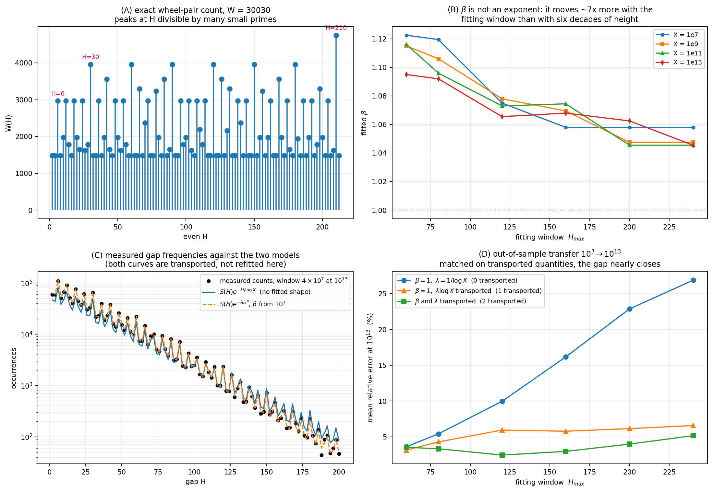

# Counting Residue Pairs in a Sieve Cycle, and the Frequency of Prime Gaps

### An exact local theorem, and an honest separation of what is proved from what is fitted

July 2026

---

## Abstract

We begin with the sieve cycle of `W = 2·3·5·7·11·13 = 30030`, represented by its reduced residues modulo `W`, and count the pairs separated by an even distance `H`. We prove that this count is given exactly by a local product with no free parameters,

```
W(H) = ∏_{p | W, p | H} (p − 1) · ∏_{p | W, p ∤ H} (p − 2) ,
```

and that after normalization it is the Hardy–Littlewood singular series truncated at `13`, up to one explicit constant. We then study how this exact local count relates to the observed frequency of gaps between *consecutive* primes, measuring gap distributions in windows of width `4×10⁷` at heights `10⁷, 10⁹, 10¹¹, 10¹³`.

The empirical part is reported with its uncertainty made explicit. A stretched exponent `β > 1` fits the data noticeably better than `β = 1` at every height, and it transfers out of sample. It is nevertheless **not** an exponent: it moves about seven times more when the fitting window in `H` is changed than when the height is changed by six orders of magnitude, and even the *sign* of its drift in height depends on the window. What it absorbs is identified: the theoretical envelope constant `λ = 1/log X` is not exact, the measured `λ·log X` lying between `1.09` and `1.16`. The recommended model is therefore `A(H) ∝ S(H)·exp(−λH)` with a single calibrated `λ` and no shape exponent — not because the shapeless model wins a prediction contest (it does not), but because `β` fails the stability test that any genuine exponent must pass.

**Keywords:** prime gaps, sieve, reduced residues, Chinese remainder theorem, singular series, Cramér model, out-of-sample testing.

---

## 1. Introduction

The starting point is a local observation about how gaps merge. A short gap sitting between two longer ones can act as a neck: if later sieve stages delete the interior points, the three merge into one. Summing over all consecutive blocks whose lengths total `H` reduces the question to a purely arithmetic one — *count the pairs of cycle points separated by `H`* — and that object turns out to have an exact closed form.

The paper has two halves, and the reason for the sharp division is methodological.

- **§§2–5 are proved.** The pair count is a theorem with a two-line local proof, verified against direct enumeration.
- **§§6–9 are empirical.** Passing from the finite sieve cycle to actual consecutive primes is a heuristic step, and everything after it is a measurement with error bars, not a derivation.

The purpose of keeping the halves visibly apart is that the second half is where a model can quietly acquire parameters that fit noise. §7 is devoted to catching exactly that.

---

## 2. Definitions and the structure of the cycle

```
W = 2·3·5·7·11·13 = 30030 ,
R_W = { a mod W : gcd(a, W) = 1 } ,        |R_W| = φ(W) = 5760 .
```

Define the **pair count**

```
W(H) = # { a mod W : gcd(a, W) = gcd(a + H, W) = 1 } .
```

`W(H)` also counts something more geometric: the number of runs of consecutive cycle points whose gaps sum to `H`, because an endpoint pair `(a, a+H)` determines a unique run between them. This is the form in which the quantity first arises from the merging picture of §1.

---

## 3. The exact pair-count theorem

**Theorem 1.** For every `H`,

```
W(H) = ∏_{p | W, p | H} (p − 1) · ∏_{p | W, p ∤ H} (p − 2) .
```

*Proof.* The condition is local at each prime `p | W`: we need `a ≢ 0` and `a ≢ −H (mod p)`. If `p | H` the two forbidden residues coincide, leaving `p − 1` admissible choices; if `p ∤ H` they are distinct, leaving `p − 2`. The primes dividing `W` are distinct, so by the Chinese remainder theorem the local choices combine multiplicatively. ∎

**Corollary 1.** If `H` is odd then the factor at `p = 2` is `2 − 2 = 0`, so `W(H) = 0`.

**Corollary 2.** `W(H)` depends on `H` only through which primes `p ≤ 13` divide it, hence it is periodic in `H` with period `W`.

---

## 4. Independent verification of the formula

The formula was checked against a direct enumeration of the reduced residues for every `H` from `1` to `8579` — **zero mismatches**. The values quoted below are the ones the later sections use.

| H | formula | direct count | primes of `W` dividing H |
|---|---|---|---|
| 2 | 1485 | 1485 | 2 |
| 6 | 2970 | 2970 | 2, 3 |
| 12 | 2970 | 2970 | 2, 3 |
| 30 | 3960 | 3960 | 2, 3, 5 |
| 32 | 1485 | 1485 | 2 |
| 42 | 3564 | 3564 | 2, 3, 7 |
| 210 | 4752 | 4752 | 2, 3, 5, 7 |

In particular `W(30)/W(32) = 3960/1485 = 2.6667`: the divisibility of `H` by many small primes, not its size, is what raises the count. Panel (A) of Figure 1 shows the whole comb.



---

## 5. Normalization, and what the normalized count is

Define

```
S(H) = W · W(H) / φ(W)² .
```

This compares the density of pairs surviving at both endpoints with the density predicted under independence, so `S(H) = 1` would mean "no arithmetic preference". Values of `H` divisible by many small primes receive an arithmetic boost, which is why the peaks fall at `6, 30, 42, 210` and their relatives.

**Proposition 1 (identification).** `S(H)` is the Hardy–Littlewood singular series for prime pairs, truncated at the primes dividing `W`. Explicitly, writing

```
𝔖(H) = 2C₂ · ∏_{p | H, p > 2} (p − 1)/(p − 2) ,      2C₂ = 2∏_{p>2} (1 − 1/(p−1)²) ,
```

one has `S(H) = κ · 𝔖(H)` with `κ = ∏_{p > 13} (1 − 1/(p−1)²)⁻¹` **whenever every odd prime factor of `H` is at most 13**, and `S(H) ≠ κ·𝔖(H)` otherwise.

*Verified numerically:* `2C₂ = 1.320323652` (literature value `1.3203236`), and the ratio `S(H)/𝔖(H)` equals `1.01802` for `H = 2, 6, 30, 42, 210, 2310`, while it is `0.95439` at `H = 34 = 2·17` and `0.99589` at `H = 94 = 2·47` — exactly the cases with an odd prime factor above `13`.

So the truncation is not free: it introduces a fixed multiplicative constant `κ` (absorbed by any overall normalization, hence harmless) plus a genuine error at those `H` whose odd part has a large prime factor. Below `H = 100` the affected values are few and the error is at most about `5%`, which is why extending `W` changes little at these ranges.

---

## 6. From local blocks to observed gap frequencies

`W(H)` is **not** the number of prime gaps of size `H`. It counts sieve opportunities within a finite cycle. For two surviving points to be *consecutive primes*, two further things must happen: both endpoints must survive all primes larger than `13`, and the interior must contain no prime at all. The model therefore splits into an arithmetic factor, which sets the peaks, and a probabilistic envelope, which sets the decay with gap length:

```
A(H; X, ΔX)  ≈  [ ΔX / (log X)² ] · S(H) · exp(−λH) ,        λ ≈ 1/log X .        (6.1)
```

The envelope is the Cramér/Poisson heuristic: given mean prime density `1/log X`, an empty stretch of length `H` costs `exp(−H/log X)`. Only the first factor is derived; the second is imported.

**The data.** All measurements below come from segmented sieves over windows of width `ΔX = 4×10⁷` placed at `X = 10⁷, 10⁹, 10¹¹, 10¹³`:

| X | primes in window | mean gap | log X | jumping champion |
|---|---|---|---|---|
| 10⁷ | 2,336,555 | 17.12 | 16.118 | 6 |
| 10⁹ | 1,928,678 | 20.74 | 20.723 | 6 |
| 10¹¹ | 1,579,024 | 25.33 | 25.328 | 6 |
| 10¹³ | 1,337,515 | 29.91 | 29.934 | 6 |

The mean gap tracks `log X` to within `0.3%` at every height, and `H = 6` is the most frequent gap throughout.

**Fitting protocol, stated because the numbers depend on it.** Even `H` in `[2, H_max]` with at least `20` occurrences; least squares on `log A(H)`; `R²` reported in log space. Value-space fitting inflates `R²` substantially because it is dominated by the few smallest gaps, and should not be used.

---

## 7. Does the data support a shape exponent `β > 1`?

Replacing the envelope `exp(−λH)` by the stretched form `exp(−λH^β)` gives a visibly better fit at every height. The question is whether `β` is an exponent or an absorber. Three tests decide it.

### 7.1 Fit quality (the weakest evidence)

At `H_max = 120`, log-space `R²`:

| X | `β = 1, λ = 1/log X` | `λ` free | `λ, β` free | fitted `β` |
|---|---|---|---|---|
| 10⁷ | 0.98249 | 0.99856 | 0.99913 | 1.0750 |
| 10⁹ | 0.97950 | 0.99881 | 0.99941 | 1.0780 |
| 10¹¹ | 0.98777 | 0.99889 | 0.99942 | 1.0730 |
| 10¹³ | 0.99219 | 0.99898 | 0.99939 | 1.0650 |

Adding `β` buys about `0.0005` in `R²` over a free `λ`. High `R²` is not evidence: this column mainly shows that a two-parameter model beats a one-parameter model, which is guaranteed.

### 7.2 Stability in the fitting window — **the decisive test**

A genuine exponent must not depend on how much of the tail one looks at. It does:

| X \ `H_max` | 60 | 80 | 120 | 160 | 200 | 240 |
|---|---|---|---|---|---|---|
| 10⁷ | 1.1225 | 1.1195 | 1.0750 | 1.0580 | 1.0580 | 1.0580 |
| 10⁹ | 1.1150 | 1.1060 | 1.0780 | 1.0695 | 1.0475 | 1.0475 |
| 10¹¹ | 1.1160 | 1.0960 | 1.0730 | 1.0745 | 1.0455 | 1.0455 |
| 10¹³ | 1.0950 | 1.0920 | 1.0655 | 1.0680 | 1.0625 | 1.0455 |

Changing the window at a fixed height moves `β` by up to `0.065`. Changing the height by six orders of magnitude at a fixed window moves it by:

| `H_max` | `β(10⁷) → β(10¹³)` | total drift |
|---|---|---|
| 80 | 1.1195 → 1.0920 | −0.0275 |
| 120 | 1.0750 → 1.0655 | −0.0095 |
| 200 | 1.0580 → 1.0625 | **+0.0045** |

So the window dependence is roughly seven times the height dependence, and at `H_max = 200` the height drift even changes sign. A statement such as "`β` drifts toward `1` as `X` grows" is therefore not supported: it is an artifact of a particular window. Panel (B) of Figure 1 shows this directly.

### 7.3 What `β` is absorbing

Fitting `λ` with `β = 1` and comparing against the theoretical value:

| X | log X | fitted `λ` | `1/log X` | `λ·log X` |
|---|---|---|---|---|
| 10⁷ | 16.118 | 0.07106 | 0.06204 | 1.1453 |
| 10⁹ | 20.723 | 0.05607 | 0.04825 | 1.1620 |
| 10¹¹ | 25.328 | 0.04418 | 0.03948 | 1.1190 |
| 10¹³ | 29.934 | 0.03647 | 0.03341 | 1.0915 |

The envelope constant in (6.1) is wrong by `9–16%`, and drifts. That mis-specification is a real, systematic feature of the model, and a free shape exponent is well placed to soak it up. The correct response is to calibrate `λ` rather than to introduce `β`.

---

## 8. Out-of-sample transfer

The strongest available test is to calibrate at one height and predict at another with no refitting of shape. Training at `10⁷`, predicting at `10¹³`:

| `H_max` | `β=1, λ=1/log X` (0 transported) | `β=1, λ·log X` transported (1) | `λ, β` transported (2) |
|---|---|---|---|
| 60 | 3.6% | — | 3.5% |
| 80 | 5.4% | 4.3% | 3.3% |
| 120 | 10.0% | 5.9% | 2.5% |
| 160 | 16.2% | — | 3.0% |
| 200 | 22.9% | 6.2% | 4.0% |
| 240 | 26.9% | — | 5.2% |

(mean relative error; log-space `R²` for the same runs is `0.986–0.995` for the first column and `0.996–0.9995` for the last.)

**This result must be reported as it is: the stretched model transfers better, at every window tested.** A claim that the shapeless model wins the transfer test does not survive this sweep.

The parameter-matched middle column is what puts the result in proportion. Most of the stretched model's advantage comes from the fact that it transports *two* calibrated numbers while the shapeless model transports *none*. Once the shapeless model is allowed one transported number — the envelope constant `λ·log X`, which §7.3 shows is not `1` — its error falls from `10.0%` to `5.9%` at `H_max = 120`, against `2.5%`. The remaining gap is real but modest, and it is bought with a parameter that §7.2 has already shown to be unstable. Panel (D) of Figure 1 shows the three curves.

---

## 9. Recommended model, and the reason for the choice

```
A(H; X, ΔX)  ≈  C(X, ΔX) · S(H) · exp(−λH) ,      λ·log X ≈ 1.1 calibrated once,
```

with **no shape exponent**. The justification is §7.2, not §8: `β` is rejected because it is not stable under a change of fitting window and its height drift is not even sign-definite, which is what disqualifies a quantity from being an exponent. It is not rejected for predicting badly — it predicts well, and that should be stated plainly.

The residual `9–16%` discrepancy in `λ·log X` is left explicit rather than absorbed. It is a genuine deficiency of the Cramér envelope at these heights and is the honest place for future work to attach.

---

## 10. Relation to the literature

- The local pair count of Theorem 1 is the finite version of the arithmetic factor in the **Hardy–Littlewood** prime-pair conjecture (1923); §5 makes the identification exact, including the truncation constant.
- The peaks at `6, 30, 210` are the **jumping champions** phenomenon. Odlyzko, Rubinstein and Wolf (1999) conjectured that the champions greater than `1` are `4` and the primorials, with `6` reigning until roughly `1.74×10³⁵`, then `30`, then `210`. The measurements here — champion `6` at all four heights — sit far below the first transition, so they confirm the regime rather than the conjecture.
- The envelope `exp(−H/log X)` is the **Cramér** probabilistic model, consistent with **Gallagher's** (1976) theorem on the average Poisson behaviour of primes in short intervals. The singular series must be retained separately: Poisson captures the envelope, not the arithmetic oscillation.
- The observation that the effective envelope constant exceeds `1/log X` (§7.3) is consistent with the refinements known to be needed in this heuristic; it is not a new phenomenon, but it is the quantity that any additional shape parameter will absorb.

---

## 11. Limitations, and what is not proved

- **Nothing here proves the Hardy–Littlewood conjecture**, nor that any particular gap occurs infinitely often.
- `W(H)` is an exact count **inside a finite sieve cycle**. The passage to actual consecutive primes (§6) is heuristic and everything downstream of it is empirical.
- **High `R²` is not evidence.** §7.1 shows a `0.0005` gain being obtainable from an unstable parameter, and value-space fitting inflates the figure further.
- The height results come from single windows of width `4×10⁷`. They carry sampling error that is not quantified here; repeated windows at each height would be needed for genuine confidence intervals.
- The rejection of `β` rests on a stability argument (§7.2), not a prediction argument. §8 goes the other way and is reported as such.
- **No independent channel.** Theorem 1 is a clean independent derivation of a known object, and the route to it — through blocks, necks and gap merging rather than through the circle method — is the only part of this work that is not standard. The arithmetic content is not new.

---

## 12. Conclusion

The pair count `W(H)` is a complete theorem with no free parameters, and it explains the arithmetic peaks exactly. Normalized, it is the truncated Hardy–Littlewood singular series, with the truncation error located precisely.

The empirical half ends in a more careful place than a single verdict. A stretched exponent `β ≈ 1.07` fits better and transfers better, and this is stated without softening. It is nonetheless rejected, because it varies more with the arbitrary choice of fitting window than with six orders of magnitude of height — a property no exponent may have — and because the deficiency it absorbs can be named: the envelope constant `λ·log X` is `1.09–1.16`, not `1`. The recommended model keeps the arithmetic factor, keeps the exponential envelope, calibrates one constant, and leaves the residual visible.

---

## Appendix A. Verification algorithm

1. Build the reduced residues modulo `W`.
2. For each `H`, count the `a` with both `a` and `a + H` in the set; compare with Theorem 1.
3. Compare `S(H)` with the full singular series, tracking the odd prime factors of `H`.
4. Segment-sieve a window of width `ΔX` at each height and histogram the consecutive-prime gaps.
5. Fit in log space, on a stated window, with a stated minimum count per bin.
6. Sweep the window: report how much every fitted quantity moves under that sweep, before interpreting it.
7. Transfer out of sample without refitting shape, and match the number of transported quantities across the models being compared.

Step 6 is the one that changes conclusions, and step 7 without the matching in §8 produces a misleading ranking.

## Appendix B. Reproducibility

`verify_paper3.py` produces §§4–8; `robust_paper3.py` produces the window sweeps of §7.2 and §8; `fig3.py` produces Figure 1. Environment: Python 3, NumPy 2.4, SymPy 1.14. Gap data: segmented sieve, `ΔX = 4×10⁷` per height.

## References

1. G. H. Hardy and J. E. Littlewood, *Some problems of "Partitio Numerorum" III: On the expression of a number as a sum of primes*, Acta Mathematica **44** (1923), 1–70.
2. P. X. Gallagher, *On the distribution of primes in short intervals*, Mathematika **23** (1976), 4–9.
3. H. Cramér, *On the order of magnitude of the difference between consecutive prime numbers*, Acta Arithmetica **2** (1936), 23–46.
4. A. Granville, *Harald Cramér and the distribution of prime numbers*, Scandinavian Actuarial Journal (1995), 12–28.
5. A. M. Odlyzko, M. Rubinstein and M. Wolf, *Jumping champions*, Experimental Mathematics **8** (1999), 107–118.
6. J. Pintz, *On the singular series in the prime k-tuple conjecture*, arXiv:1004.1084 (2010).
