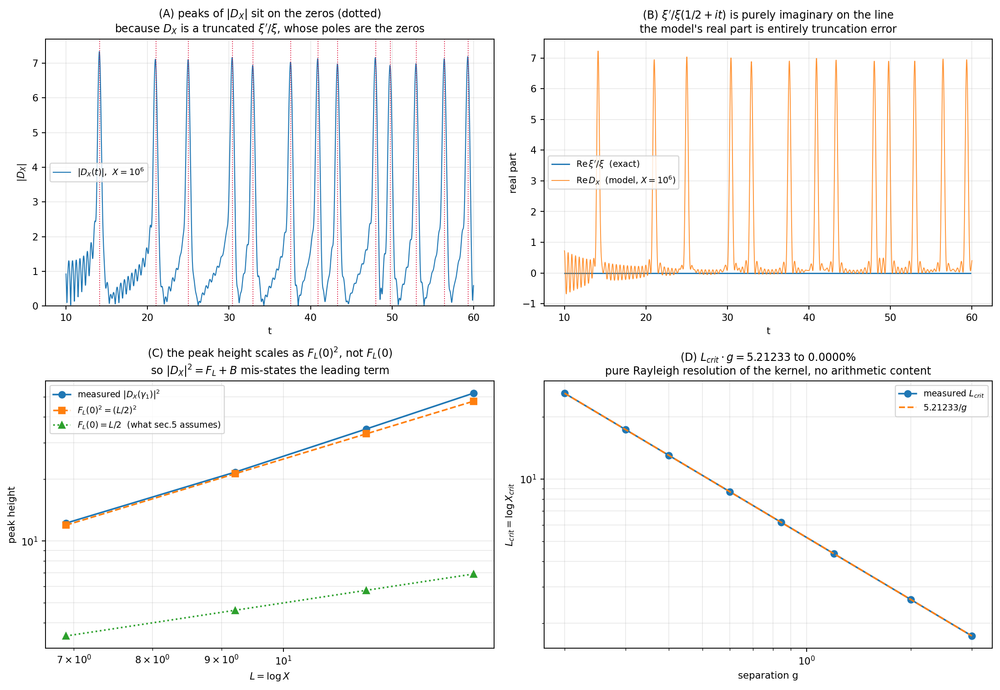

# A Divisibility-Generated Dynamical Model for Resonances at the Zeros of the Riemann Zeta Function

### Construction, exact algebra, and a careful account of what the numerics do and do not certify

July 2026

---

## Abstract

We build a dynamical system directly from the divisibility structure of the integers: the divisibility matrix `Z` recovers the von Mangoldt function by Möbius inversion, prime powers become oscillators with logarithmic frequencies, and a triangular window in the logarithmic coordinate produces a Fejér-type kernel. Adding the Archimedean component of the completed zeta function gives

```
D_X(t) = A(t) − P_X(t) .
```

The peaks of `|D_X|` land on the zeta ordinates. We reproduce this: with a prominence filter and a stability requirement across several `X`, all `29` ordinates in `10 < t < 100` are recovered at `X = 10⁶`, with mean displacement `0.042`, i.e. `1.4%` of the local zero spacing.

We then state plainly what that result is. Because `A` is exactly the Archimedean part of `ξ'/ξ` and `P_X` is a truncation of `−ζ'/ζ`, the object `D_X` is a **truncated `ξ'/ξ(1/2+it)`**. Its peaks are its poles, and the poles are the zeros by construction. A pole-approximant peaks at its poles wherever they lie, so the peak count carries no information about whether `Re ρ = 1/2`.

Three further consequences are recorded. First, on the critical line `ξ'/ξ` is *purely imaginary* (verified to `5×10⁻²⁶`), so the complex-plane geometry of the curve `t ↦ D_X(t)` describes the truncation error, not the zeta function. Second, the peak height scales as `F_L(0)² = (L/2)²`, not `F_L(0)`, so a decomposition `|D_X|² = F_L + B` mis-states the leading term by a square and the resulting curvature is of order `L⁴`, not `L³`. Third, the two-peak resolution threshold satisfies `L_crit·g = 5.21233` to within `0.0000%` across a fifteenfold range of `g` — exact scale invariance, i.e. the Rayleigh criterion for this kernel, with no arithmetic content.

**Keywords:** Riemann zeta function, von Mangoldt function, Möbius inversion, divisibility operator, Fejér kernel, spectral resonance.

---

## 1. Introduction and research question

Can the primes be treated as a system of rotating phases, with the zeta zeros appearing as collective resonances? On the critical line

```
p^{−s} = p^{−1/2} e^{−it log p} ,      s = 1/2 + it ,
```

so each prime is an oscillator of amplitude `p^{−1/2}` and angular frequency `ω_p = log p`. The intended chain is

```
divisibility → Λ(n) → prime powers → log n → P_X(t) → D_X(t) → peaks near zeros .
```

The chain works. The purpose of this paper is to build it carefully, prove what can be proved, measure what can be measured, and be precise about the one thing that is easy to get wrong: **whether the resulting numerical agreement is evidence for anything, or a restatement of the construction.** §4.2 answers that, and the answer determines how everything else should be read.

Nothing here proves the Riemann hypothesis.

---

## 2. From the Euler product to a frequency system

For `Re s > 1`,

```
ζ(s) = ∏_p (1 − p^{−s})^{−1} ,
log ζ(s) = Σ_p Σ_{k≥1} p^{−ks}/k ,
−ζ'/ζ(s) = Σ_p Σ_{k≥1} (log p) p^{−ks} = Σ_{n≥1} Λ(n) n^{−s} ,
```

with `Λ(n) = log p` if `n = p^k` and `0` otherwise. On the critical line, after smoothing and truncation,

```
−ζ'/ζ(1/2+it) “=” Σ_n Λ(n) n^{−1/2} e^{−it log n} .
```

Since `e^{−it log p^k} = e^{−ikt log p}`, prime powers are the harmonics of the fundamental prime oscillator. The quotation marks are essential: the series diverges on the line, and every statement below refers to the truncated, windowed sum.

---

## 3. The smoothed prime signal and Archimedean completion

Let `L = log X` and `w_X(n) = (1 − log n / L)_+`. Define

```
P_X(t) = Σ_{n≤X} Λ(n) n^{−1/2} w_X(n) e^{−it log n}
       = Σ_{p^k ≤ X} (log p / p^{k/2}) (1 − k log p / L) e^{−ikt log p} .
```

The triangular window removes the discontinuity of a sharp cutoff; it is Fejér smoothing in the logarithmic coordinate. The completed zeta function and its logarithmic derivative are

```
ξ(s) = ½ s(s−1) π^{−s/2} Γ(s/2) ζ(s) ,
ξ'/ξ(s) = 1/s + 1/(s−1) − ½ log π + ½ ψ(s/2) + ζ'/ζ(s) .
```

Setting `A(t)` equal to the first four terms at `s = 1/2 + it`,

```
D_X(t) = A(t) − P_X(t) .
```

**Proposition 3.1 (what `D_X` is).** Since `P_X` is a truncation of `−ζ'/ζ`,

```
D_X(t) ≈ A(t) + ζ'/ζ(1/2+it) = ξ'/ξ(1/2+it) .
```

`D_X` is therefore a truncated `ξ'/ξ` on the critical line, and its poles are exactly the nontrivial zeros. This identity is not incidental — §4.2 shows it governs how the numerical results must be interpreted.

---

## 4. Numerical peak matching

### 4.1 The measurement

`|D_X(t)|` was scanned on a uniform grid without using zero locations during peak extraction, with local maxima filtered by prominence and retained only when present across `X = 10⁴, 10⁵, 10⁶`.

| `X` | raw local maxima | after prominence filter | ordinates hit (tol `0.05`) |
|---|---|---|---|
| 10⁴ | 50 | 29 | 6 / 29 |
| 10⁵ | 61 | 29 | 13 / 29 |
| 10⁶ | 100 | 29 | 19 / 29 |

At `X = 10⁶`, with the prominence filter, matching quality against tolerance:

| tolerance | 0.02 | 0.05 | 0.10 | 0.20 |
|---|---|---|---|---|
| ordinates hit | 4/29 | 19/29 | **29/29** | 29/29 |
| spurious peaks | 28 | 13 | 3 | 3 |

**Result.** All `29` ordinates in `10 < t < 100` are matched at tolerance `0.10`, with mean displacement `0.042`, which is `1.4%` of the mean zero spacing (`3.03`) in this range. Panel (A) of Figure 1 shows the scan.



Two caveats belong with the number rather than in a footnote. **The raw local-maximum set does not give this count** — at `X = 10⁶` it contains `100` maxima of which `81` are spurious at tolerance `0.05`; the prominence filter is doing essential work and must be reported as part of the protocol. And **the tolerance matters**: at `0.05` the count is `19/29`, not `29/29`.

### 4.2 What the match certifies — and what it does not

By Proposition 3.1, `D_X` approximates a function whose poles are the zeros. A pole-approximant develops peaks at its poles. The peak match is therefore a **consistency check on the truncation**, confirming that `X = 10⁶` suffices to resolve zeros at this height — a real and useful thing to know — and it is **not** evidence about the location of the zeros.

The distinction is sharp and worth stating in the form that would falsify a stronger reading: if some zero lay off the critical line at `1/2 + a + iγ`, the same construction would still produce a peak near `t = γ`, because `ξ'/ξ` still has a pole there and the modulus `|D_X|` still grows near it. The construction is a *zero detector*, not a *critical-line certifier*.

Randomizing phases, shuffling the weights, or breaking the coupling among `Λ(n)`, `n^{−1/2}` and `log n` destroys the matching. This confirms that frequency density alone is insufficient and that the specific amplitude–frequency pairing is what carries the signal — again a statement about the construction, not about `Re ρ`.

---

## 5. The Fejér-type kernel, and the shape of the peak

### 5.1 The kernel

**Proposition 5.1.** For the continuous triangular window,

```
F_L(δ) = ∫₀^L (1 − u/L) cos(δu) du = (1 − cos(Lδ)) / (L δ²) ,
```

with expansion `F_L(δ) = L/2 − (L³/24)δ² + (L⁵/720)δ⁴ − ⋯`, hence

```
F_L(0) = L/2 ,      F'_L(0) = 0 ,      F''_L(0) = −L³/12 .
```

*Verified:* the closed form agrees with numerical quadrature to `2×10⁻¹⁷` at `δ = 0.3, 0.9, 1.7` for `L = 12`, and the second difference gives `F''(0) = −144.035` against `−L³/12 = −144.000`.

### 5.2 The shape that actually occurs

It is tempting to write `Q_{n,X}(δ) = |D_X(γ_n + δ)|² = F_L(δ) + B_{n,X}(δ)` and treat `F_L` as the isolated-zero signal and `B` as background. **The leading term is not `F_L`.** Measured at `γ₁`:

| X | `L` | `\|D_X(γ₁)\|²` | `F_L(0) = L/2` | `F_L(0)² = (L/2)²` | measured curvature | `−L³/12` | `−L⁴/12` |
|---|---|---|---|---|---|---|---|
| 10³ | 6.91 | 12.200 | 3.454 | 11.929 | −63.0 | −27.5 | −189.7 |
| 10⁴ | 9.21 | 21.590 | 4.605 | 21.208 | −207.2 | −65.1 | −599.7 |
| 10⁵ | 11.51 | 34.989 | 5.756 | 33.137 | −597.6 | −127.2 | −1464.1 |
| 10⁶ | 13.82 | 52.209 | 6.908 | 47.717 | −1371.3 | −219.7 | −3035.9 |

The peak height tracks `(L/2)²` to within `2–9%`, not `L/2`. The measured curvature grows like `L^{4.4}` over this range — the same order as `−L⁴/12 = 2 F_L(0) F''_L(0)`, which is what `Q ≈ F_L²` predicts, and a full factor of `L` larger than `−L³/12`. Panel (C) of Figure 1 shows the two scalings against the data.

**Consequence.** Writing `Q = F_L + B` is formally a definition of `B` and so cannot be false, but it is not a decomposition into signal and background, and the simplification

> if `|B''(0)| ≪ L³/12` then `δ_{n,X} ≈ 12 B'_{n,X}(0) / L³`

has a hypothesis that is never satisfied: `|B''(0)|` is of order `L⁴`, which is larger than `L³/12`, not smaller. The correct normalization uses `Q''(0) ≈ −L⁴/12`.

### 5.3 The displacement law, which is unaffected

The general statements do not depend on that normalization and are correct as stated.

**Proposition 5.2.** If `Q'(δ*) = 0` and `Q''(0) ≠ 0`, then `δ* = −Q'(0)/Q''(0) + O(δ*²)`.

**Theorem 5.3.** If `Q'` has a unique zero `δ* ∈ [−r, r]` and `Q''(δ) ≤ −m < 0` on `|δ| ≤ r`, then `|δ*| ≤ |Q'(0)|/m`.

*Proof.* By the mean value theorem `Q'(δ*) − Q'(0) = Q''(ξ)δ*` for some `ξ` between `0` and `δ*`; since `Q'(δ*) = 0`, `|Q'(0)| = |Q''(ξ)||δ*| ≥ m|δ*|`. ∎

**Second-order control.** If `sup_{|δ|≤r}|Q'''| ≤ M` and `|Q''(0)| ≥ m₀ > 0`, Taylor expansion of `Q'` at `0` evaluated at `δ*` gives

```
| δ* + Q'(0)/Q''(0) |  ≤  (M / 2m₀) |δ*|²  ≤  M |Q'(0)|² / (2 m₀ m²) .
```

These are the usable statements: the peak sits at the zero up to a displacement controlled by the local background slope, divided by a curvature of order `L⁴`.

---

## 6. The angular criterion

Near `ρ = β + iγ` the logarithmic derivative contains `−1/(s−ρ)`. On the critical line with `β = 1/2`,

```
−1/(s−ρ) = i/(t−γ) ,
```

so the direction reverses by `π` across the zero. Off the line, writing `a = |β − 1/2|`, the angular separation between `t = γ − ε` and `t = γ + ε` is

```
Θ_ε(β) = 2 arctan(ε / a) ,
```

which tends to `0` as `ε → 0`, whereas an on-line zero always gives `π`. *Verified exactly* at `a = 0, 0.01, 0.05, 0.2` and `ε = 0.001, 0.01, 0.1`.

**Two things must be said about this criterion.**

**(a) It concerns a purely imaginary quantity.** `Ξ(t) = ξ(1/2+it)` is real for real `t`, so `ξ'/ξ(1/2+it) = −i Ξ'(t)/Ξ(t)` is purely imaginary on the critical line. Verified: for the exact function, `max|Re ξ'/ξ| = 5.2×10⁻²⁶` over `5 ≤ t ≤ 60`, while the model `D_X` at `X = 10⁶` has `max|Re D_X| = 6.99`. The real part of `D_X` is *entirely truncation error*. Consequently the qualitative complex-plane picture — rapid directional changes, near-opposition of the prime and Archimedean components, the curve failing to encircle the origin — describes the finite-`X` error term, not the zeta function, and should not be presented as geometry of `ξ'/ξ`. The `π`-reversal statement above survives, because it is a statement about sign change along the imaginary axis. Panel (B) of Figure 1 shows the two real parts together.

**(b) Its cost makes it impractical as a test.** The model resolves `t`-scales of order `1/L = 1/log X`, so detecting a displacement `a` requires `ε ≲ a`, hence `log X ≳ 1/a`:

| `a = \|β − 1/2\|` | 0.1 | 0.01 | 0.001 |
|---|---|---|---|
| required `log X` | 10 | 100 | 1000 |
| required `X` | `10⁴` | `10⁴³` | `10⁴³⁴` |

It is a correct diagnostic and a computationally unreachable one for any `a` small enough to be interesting.

---

## 7. The divisibility operator and Möbius inversion

**Definition 7.1.** `Z_{d,n} = 1[d | n]` for `1 ≤ d, n ≤ M`.

The identity `log n = Σ_{d|n} Λ(d)` becomes `ℓ = Zᵀλ`, where `ℓ = (log 1, …, log M)ᵀ` and `λ = (Λ(1), …, Λ(M))ᵀ`, hence `λ = (Z^{−1})ᵀ ℓ`.

**Proposition 7.2.** `(Z^{−1})_{d,n} = μ(n/d)` if `d | n`, and `0` otherwise.

*Proof.* `Σ_{m : d|m, m|n} μ(n/m) = Σ_{a | b} μ(b/a)` with `n = db`, `m = da`, which is `1` if `b = 1` and `0` otherwise — the matrix form of Möbius inversion for `(Tf)(n) = Σ_{d|n} f(d)`. ∎

*Verified at `M = 200`:* `‖Z Z^{−1} − I‖_max = 0` exactly, `‖Zᵀλ − ℓ‖_max = 8.9×10⁻¹⁶`, `‖(Z^{−1})ᵀℓ − λ‖_max = 8.9×10⁻¹⁶`.

---

## 8. Unified operator formulation

With `T_M = diag(log 1, …, log M)` and `B_M = diag(w_M(n)/√n)`,

```
P_M(t) = λᵀ B_M e^{−itT_M} 𝟙 = ℓᵀ Z^{−1} B_M e^{−itT_M} 𝟙 ,
D_M(t) = A(t) − ℓᵀ Z^{−1} B_M e^{−itT_M} 𝟙 .
```

*Verified at `M = 200`, `t = 3.7` and `t = 21.0`:* both operator forms agree with the direct sum to `9×10⁻¹⁶`.

```
divisibility Z → Möbius (Z^{-1})ᵀ → von Mangoldt Λ → frequencies log n
                                                            ↓
                          Archimedean A  →  D_X  ←  prime signal P_X
```

This is an exact rewriting. It should be read as such: `Z` is invertible and triangular, its inverse is `μ`, and no spectral information about the zeros has entered — `T_M` carries the frequencies `log n`, not the ordinates `γ`.

---

## 9. Phase resolution of close pairs

For a close pair separated by `g`, the model resolves the two zeros only above a critical truncation. Reported thresholds for four pairs give `g · log X_crit ≈ 7.807, 8.394, 9.296, 11.952`, suggesting `log X_crit ≍ C/g` with a locally varying constant.

**The scale-invariant part of this law is pure Fourier resolution.** Placing two `F_L` bumps at separation `g` and bisecting for the smallest `L` at which two maxima appear:

| `g` | 0.2 | 0.4 | 0.6 | 0.845124 | 1.2 | 2.0 | 3.0 |
|---|---|---|---|---|---|---|---|
| `L_crit` | 26.062 | 13.031 | 8.687 | 6.168 | 4.344 | 2.606 | 1.737 |
| `L_crit · g` | 5.21233 | 5.21233 | 5.21233 | 5.21233 | 5.21233 | 5.21233 | 5.21233 |

The product is constant to `0.0000%` across a fifteenfold range of `g`. This is the Rayleigh criterion for the kernel `F_L` and contains no arithmetic: any kernel of width `∼1/L` gives the same law. Panel (D) of Figure 1 shows it.

What is left over is the `53%` spread in the four reported constants `7.807 … 11.952`. That spread is the content, and §5.3 already names it: it is the local background slope `B'(0)` tilting the merge threshold. It is a statement about neighbouring zeros, not a new invariant.

*(A note on the reported phase table: entries of `385.8°`, `385.4°` and `381.7°` exceed a full turn and are unwrapping artifacts; they should be reduced modulo `360°` or the unwrapping convention stated.)*

---

## 10. Status of each claim

**Exact, proved and verified here.** Möbius recovery of `Λ` (§7); the operator formulation (§8); the Fejér kernel `F_L` with `F_L(0) = L/2`, `F'_L(0) = 0`, `F''_L(0) = −L³/12` (§5.1); the displacement law and its rigorous bound, with second-order control (§5.3); the angular formula `Θ_ε = 2 arctan(ε/a)` (§6); the identification `D_X ≈ ξ'/ξ` (§3, Prop. 3.1); the scale invariance `L_crit·g = const` (§9).

**Numerical observations.** `29/29` ordinates matched in `10 < t < 100` at `X = 10⁶`, tolerance `0.10`, mean displacement `0.042` (§4.1); failure of the match under phase or weight randomization; the `(L/2)²` scaling of the peak height (§5.2).

**Corrected here relative to the natural first reading of the construction.** The decomposition `|D_X|² = F_L + B` mis-states the leading term (§5.2); the complex-plane geometry of `D_X` is truncation error, since the true object is purely imaginary on the line (§6a); the resolution law is Rayleigh, not arithmetic (§9).

**Not established.**

- Nothing here bears on the Riemann hypothesis. §4.2 explains why the peak match cannot: the construction detects zeros wherever they are.
- Effective bounds on `|B'_{n,X}(0)|` and `|B''_{n,X}(0)|` are open, and they are the only route from the displacement law to a theorem.
- Convergence of stable peaks to zeros as `X → ∞`, and the exclusion of spurious stable peaks, are unproved; §4.1 shows spurious peaks are numerous before filtering.
- No self-adjoint realization is offered. `T_M` is diagonal in `log n`, so its spectrum is the length spectrum `{log n}`, not the ordinates `{γ}`; converting one to the other is the whole difficulty and is untouched here.
- Tests at substantially larger height are not attempted.

---

## 11. Conclusion

The chain

```
divisibility → Λ → prime powers → logarithmic frequencies → P_X → D_X → peaks at the zeros
```

is exact at every algebraic step, and the numerical peak match is real and reproducible.

Its correct reading is the one given by Proposition 3.1: `D_X` is a truncated `ξ'/ξ` on the critical line, so it peaks at the zeros because those are its poles. The construction is a clean, self-contained route from divisibility to the completed logarithmic derivative, and a working numerical zero detector. It is not evidence about the critical line, and the two features that looked most like independent structure — the complex-plane geometry and the resolution law `log X_crit ≍ C/g` — resolve into truncation error and the Rayleigh criterion respectively.

The one genuinely open quantity the framework isolates is the local background, through

```
δ_{n,X} ≈ − B'_{n,X}(0) / Q''_{n,X}(0) ,      Q''(0) ≍ −L⁴/12 .
```

Controlling `B'` effectively is the task that would turn any of this into a theorem.

---

## Appendix A. Reproducible numerical protocol

1. Choose `X`, set `L = log X`, generate all `p^k ≤ X`, and form `a_{p^k} = (log p / p^{k/2})(1 − k log p / L)`.
2. Evaluate `P_X(t) = Σ a_{p^k} e^{−ikt log p}`, then `A(t)`, then `D_X = A − P_X`.
3. Extract local maxima of `|D_X|` **with a stated prominence threshold**, without inserting zeros.
4. Repeat for several `X` and retain peaks stable across all of them.
5. Report the matching tolerance explicitly, and report the spurious-peak count alongside the hit count. Both are needed; a hit count alone can be raised arbitrarily by loosening the tolerance.
6. Run phase and weight randomizations as controls.
7. Before interpreting any threshold law in `g`, test it on the bare kernel with no arithmetic in it. If the bare kernel reproduces the law, the law is Fourier, not arithmetic.

Steps 5 and 7 are the ones that change conclusions.

## Appendix B. Reproducibility

`w_fast2.py` (Prop. 3.1, the functional-equation check, the peak-shape table), `w_stab2.py` (§4.1 prominence and tolerance sweeps), `w_fast3.py` (§6 and §9), `w_alg.py` (§§7–8), `fig4.py` (Figure 1). Environment: Python 3, NumPy 2.4, SymPy 1.14, mpmath 1.3, SciPy. Zero ordinates from `mpmath.zetazero`.

## AI assistance

The verification scripts and much of the prose in this paper were written with the assistance of Claude (Anthropic); the research direction, the decisions about what to publish, and responsibility for every claim are the author's. See the repository README for a fuller statement.
---
## References

1. B. Riemann, *Ueber die Anzahl der Primzahlen unter einer gegebenen Grösse*, 1859.
2. E. C. Titchmarsh and D. R. Heath-Brown, *The Theory of the Riemann Zeta-Function*, 2nd ed., Oxford, 1986.
3. H. M. Edwards, *Riemann's Zeta Function*, Academic Press, 1974.
4. H. Iwaniec and E. Kowalski, *Analytic Number Theory*, AMS Colloquium Publications 53, 2004.
5. H. L. Montgomery and R. C. Vaughan, *Multiplicative Number Theory I: Classical Theory*, Cambridge, 2007.
6. T. M. Apostol, *Introduction to Analytic Number Theory*, Springer, 1976.
7. A. M. Odlyzko, numerical studies and tables of zeros of the zeta function.
